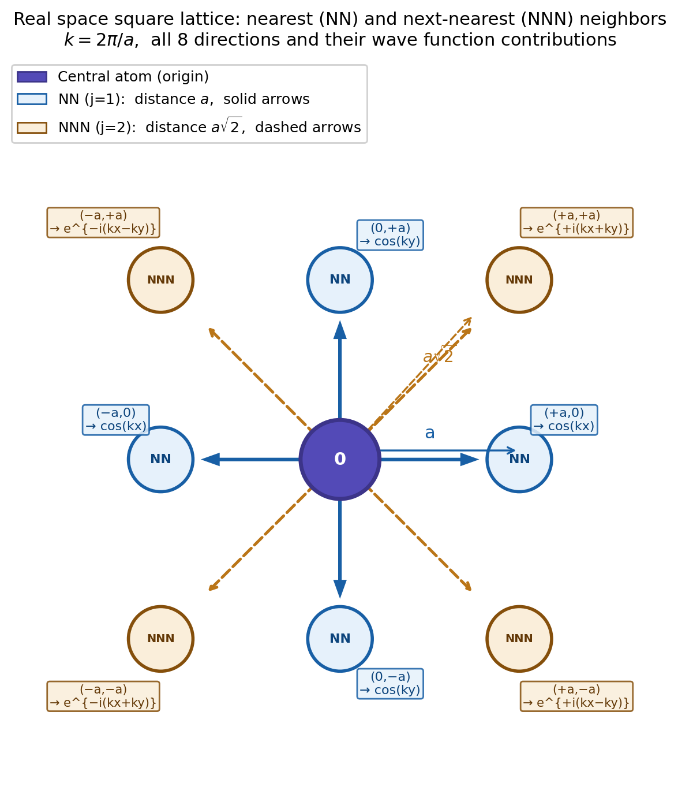
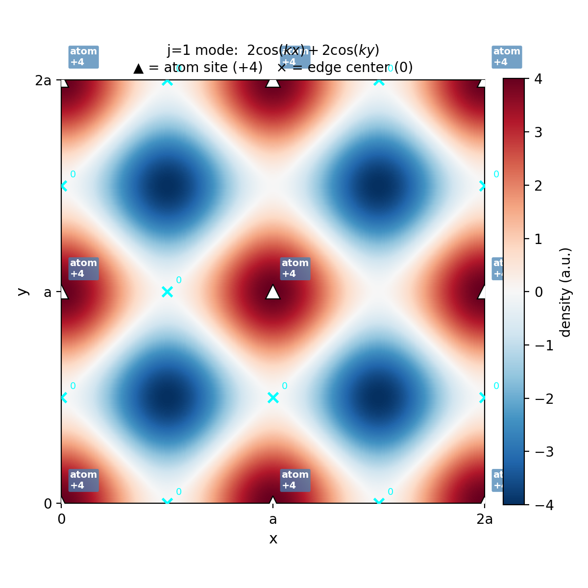
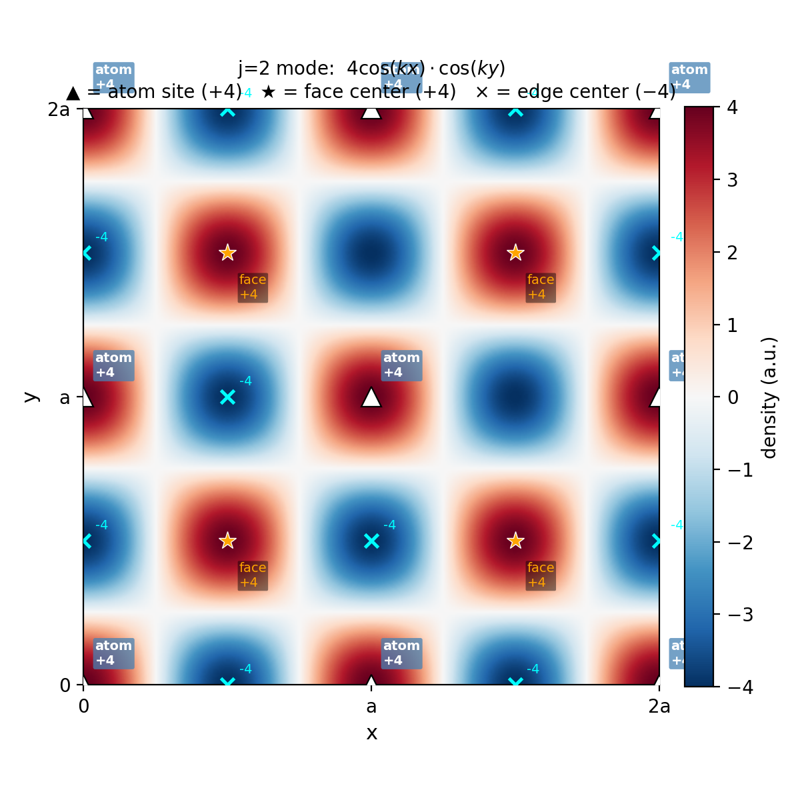
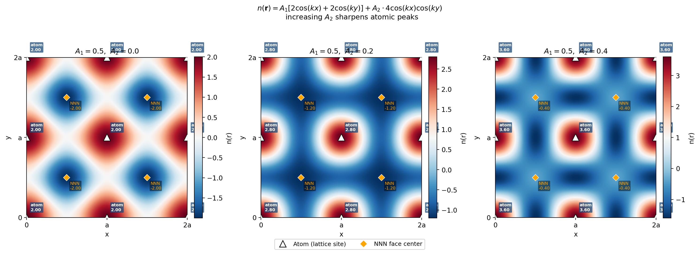
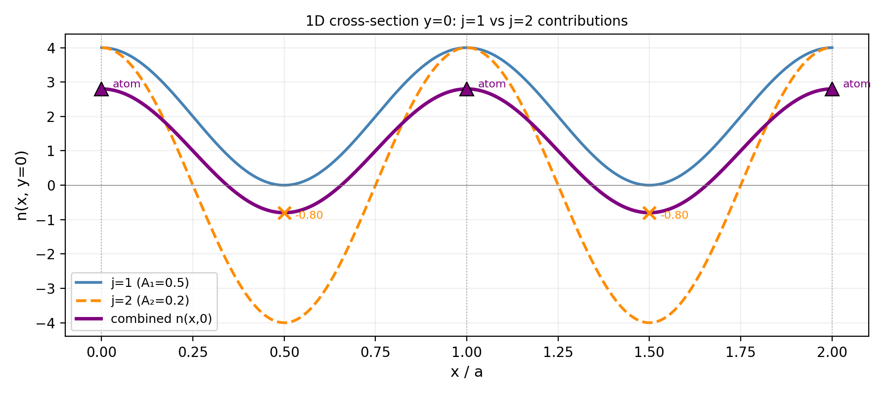

# PFC Square Lattice Density Function: Derivation & Visualization

Derivation and visualization of the two-mode PFC density function for a square lattice, with annotated nearest-neighbor (j=1) and next-nearest-neighbor (j=2) modes.

> **Author:** Tianmeng Zhang | Technion – Israel Institute of Technology, MSc Materials Science & Engineering

---

## Final result

$$n(\mathbf{r}) = A_1\!\left[2\cos\frac{2\pi x}{a} + 2\cos\frac{2\pi y}{a}\right] + A_2 \cdot 4\cos\frac{2\pi x}{a}\cos\frac{2\pi y}{a}$$

---

## Step 1 — Real space lattice: NN and NNN neighbors

The square lattice has two types of neighbors relative to the central atom:

- **Nearest neighbors (NN, j=1):** 4 atoms along ±x and ±y axes, distance = **a**
- **Next-nearest neighbors (NNN, j=2):** 4 atoms along diagonal directions, distance = **a√2**

Each neighbor direction contributes one exponential term `e^(iG·r)`. Conjugate pairs combine via Euler's formula into real cosine terms.



---

## Step 2 — j=1 mode: 4 nearest-neighbor directions

The 4 NN directions sum to:

$$\sum_{l=1}^{4} e^{i\mathbf{G}_l \cdot \mathbf{r}} = 2\cos(kx) + 2\cos(ky)$$

This produces a grid pattern with **maximum density (+4) at lattice sites** and zero density at edge centers.



---

## Step 3 — j=2 mode: 4 next-nearest-neighbor directions

The 4 NNN diagonal directions sum via the product-to-sum identity to:

$$\sum_{l=5}^{8} e^{i\mathbf{G}_l \cdot \mathbf{r}} = 4\cos(kx)\cos(ky)$$

This produces a checkerboard pattern. Crucially, the j=2 mode is **−4 at edge centers**, which suppresses the density between atoms when combined with j=1.



---

## Step 4 — Combined density: peak sharpening

Combining both modes with amplitudes A₁ and A₂:

$$n(\mathbf{r}) = A_1[2\cos(kx)+2\cos(ky)] + A_2 \cdot 4\cos(kx)\cos(ky)$$

Increasing A₂ sharpens the atomic density peaks — making them more delta-function-like and physically realistic.

| Position | j=1 | j=2 | Physical role |
|---|---|---|---|
| Lattice site (0,0) | +4 | +4 | Density maximum = **atom** |
| Edge center (a/2, 0) | 0 | −4 | j=2 suppresses density |
| Face center (a/2, a/2) | −4 | +4 | Modes partially cancel |



---

## Step 5 — 1D cross-section along x-axis

Along y=0, the individual mode contributions and their sum are clearly visible. Atomic peaks (triangles) coincide with density maxima of the combined field.



---

## Usage

```bash
pip install numpy matplotlib
python src/visualize_density.py
# figures saved to results/
```

---

## File structure

```
pfc-density-derivation/
├── docs/
│   ├── derivation.md        ← full mathematical derivation
│   └── images/              ← figures used in this README
├── src/
│   └── visualize_density.py ← visualization code
├── requirements.txt
└── README.md
```

---

## Reference

Elder, K.R., Grant, M. (2004). Modeling elastic and plastic deformations in nonequilibrium processing using phase field crystals. *Physical Review E*, 70, 051605.
